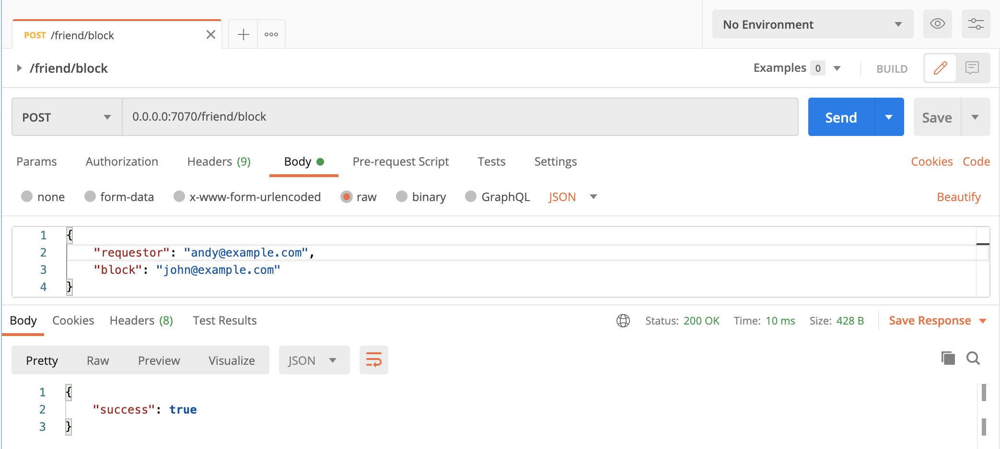

# [ golang-restAPI-FR ]:

Build simple golang restfull API. It features a simple and better performance, and customize with requirements needed.

### Required

 * GO 1.17.5 - [go1.17.5](https://go.dev/doc/devel/release#go1.17).

### Using

- Gin Web Framework 1.3.0 - [Gin-Gionic](https://github.com/gin-gonic/gin)
- MySQL 5.7.26 - [MySQL](https://dev.mysql.com/doc/relnotes/mysql/5.7/en/news-5-7-26.html)
- Go Validator v10 - [go-validator](https://github.com/go-playground/validator)

<br>

---
<h2>Installation</h2>

* Init workdir
```sh
git clone https://github.com/F-8-Developer/golang-restAPI-FR.git
cd golang-restAPI-FR
```

* Build mod Vendor
```sh
# make sure you have folder vendor in your root directory "golang-restAPI-FR/vendor"
# if you dont have folder vendor create new one with this command 
mkdir vendor

# install golang package in folder vendor
go mod vendor
```

* Copy .env.example to .env
```sh
cp .env.example .env
# change default config .env with your local config

APP_ENV=development
APP_ADDRESS=0.0.0.0:7070

DB_CONNECTION=mysql
DB_HOST=127.0.0.1
DB_PORT=3306
DB_DATABASE=rest_api_db
DB_USERNAME=root
DB_PASSWORD=

```

* Database Note
```sh
# restAPI will automatically migrate when there is no table in you database
```

* Start restAPI 
```sh
# start with default
go run server.go
```

If running normally, you can access <a href="http://0.0.0.0:7070">http://0.0.0.0:7070</a>

---
<h2>Dockerize</h2>
<br>

#### Use docker to compile and start

```sh
# Compile the image
docker build -t golang-restapi-fr .

# Create container
docker container create --name golang-restapi-fr -e APP_ADDRESS=0.0.0.0:7070 -e DB_CONNECTION=mysql -e DB_HOST=127.0.0.1 -e DB_PORT=8889 -e DB_DATABASE=rest_api_db -e DB_USERNAME=root -e DB_PASSWORD=root -p 7070:7070 golang-restapi-fr

# Start Container
docker container start golang-restapi-fr
docker container ls

# for mac user check database connection because DB_HOST=docker.for.mac.localhost
# command check log docker container
# $ docker logs <container id>
```

#### Run From Docker hub

```sh
# Download container image from https://hub.docker.com/
docker container create --name golang-restapi-fr -e APP_ADDRESS=0.0.0.0:7070 -e DB_CONNECTION=mysql -e DB_HOST=127.0.0.1 -e DB_PORT=8889 -e DB_DATABASE=rest_api_db -e DB_USERNAME=root -e DB_PASSWORD=root -p 7070:7070 jinrave/golang-restapi-fr

# Start Container
docker container start golang-restapi-fr
docker container ls

```

---
<h2>Rest API</h2>

1. Endpoint

    | METHOD | URL                          | INFO                                              |
    | ------ | :-------------               | :-------------                                    |
    | GET    | /                            | index                                             |
    | POST   | /friend/request              | for create a friend request                       |
    | POST   | /friend/accept               | to accept friend request                          |
    | POST   | /friend/reject               | to reject friend request                          |
    | POST   | /friend/list-request         | list of friend requests by user email             |
    | POST   | /friend/list-friends         | list of friends by user email                     |
    | POST   | /friend/list-friends-between | friends list between two email addresses          |
    | POST   | /friend/block                | blocked users cannot send friend request          |

2. Example Api
   > friend request api : http://0.0.0.0:7070/friend/request

    ```text
    POST /friend/request HTTP/1.1
    Host: 0.0.0.0:7070
    Content-Type: application/json
    Content-Length: 69

    {
        "requestor": "andy@example.com",
        "to": "john@example.com"
    }
    
    response:
    {
        "success": true
    }
    ```
    
    <br>
    <br>
    <br>
    > accept friend request api : http://0.0.0.0:7070/friend/accept

    ```text
    request:

    POST /friend/accept HTTP/1.1
    Host: 0.0.0.0:7070
    Content-Type: application/json
    Content-Length: 69

    {
        "requestor": "andy@example.com",
        "to": "john@example.com"
    }
    
    response:
    {
        "success": true
    }
    ```
    
    <br>
    <br>
    <br>
    > reject friend request api : http://0.0.0.0:7070/friend/reject

    ```text
    POST /friend/reject HTTP/1.1
    Host: 0.0.0.0:7070
    Content-Type: application/json
    Content-Length: 69

    {
        "requestor": "andy@example.com",
        "to": "john@example.com"
    }

    response:
    {
        "success": true
    }

    ##
    # if friend request already accepted or there in no friend request, will return "success": false
    ##
    ```
    
    <br>
    <br>
    <br>
    > list of friend requests api : http://0.0.0.0:7070/friend/list-request

    ```text
    request:

    POST /friend/list-request HTTP/1.1
    Host: 0.0.0.0:7070
    Content-Type: application/json
    Content-Length: 36

    {
        "email": "john@example.com" 
    }

    response:
    {
        "requests": [
            {
                "requestor": "andy@example.com",
                "status": "accepted"
            },
            {
                "requestor": "joe@example.com",
                "status": "rejected"
            },
            {
                "requestor": "grace@example.com",
                "status": "pending"
            }
        ]
    }
    ```
    
    <br>
    <br>
    <br>
    
    > list of friends api : http://0.0.0.0:7070/friend/list-friends

    ```text
    POST /friend/list-friends HTTP/1.1
    Host: 0.0.0.0:7070
    Content-Type: application/json
    Content-Length: 36

    {
        "email": "andy@example.com" 
    }
    
    response:
    {
        "friends": [
            "john@example.com",
            "joe@example.com"
        ]
    }
    ```
    
    <br>
    <br>
    <br>
    > friends list between api : http://0.0.0.0:7070/friend/list-friends-between

    ```text
    POST /friend/list-friends-between HTTP/1.1
    Host: localhost:7070
    Content-Type: application/json
    Content-Length: 80

    {
        "friends":[
            "andy@example.com",
            "john@example.com"
        ]
    }
    
    response:
    {
        "success": true,
        "friends": [
            "frank@example.com"
        ],
        "count": 1
    }
    ```
    
    <br>
    <br>
    <br>
    > friend block api : http://0.0.0.0:7070/friend/block

    ```text
    POST /friend/block HTTP/1.1
    Host: 0.0.0.0:7070
    Content-Type: application/json
    Content-Length: 73

    {
        "requestor": "andry@example.com",
        "block": "john@example.com"
    }
    
    response:
    {
        "success": true
    }
    ```
    
    <br>
    
    <br>
    <br>
    <br>
---
<h2>Validation</h2>

Add validation to all request API for better experience.

---
## Authors

* **Ax7-cmd** - *Initial work* - [Ax7](https://github.com/Ax7-cmd).